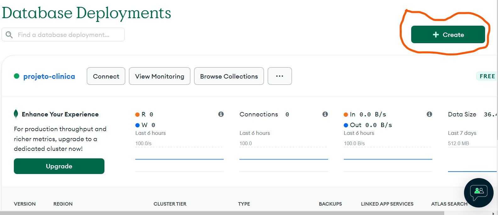

# Passo a Passo para criação de um novo Cluster

### Passo 1: 

<h1 align="center">
  
</h1>

### Passo 2:

<h1 align="center">
  
</h1>

### Passo 3:

<h1 align="center">
  
</h1>

### Passo 4:

<h1 align="center">
  
</h1>